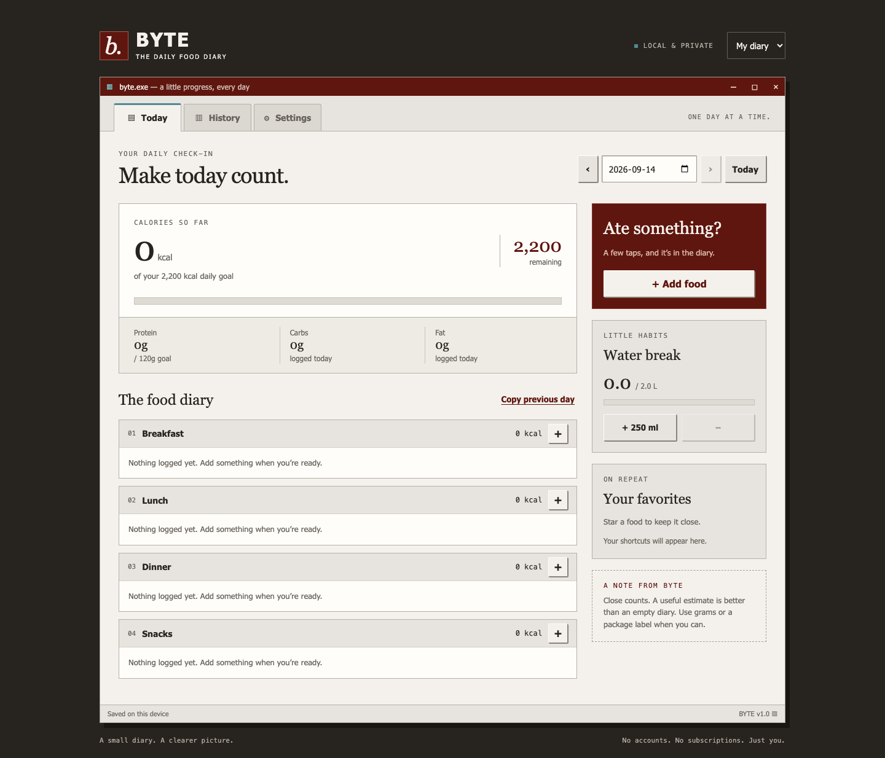

# Byte Milad

A small, private calorie diary with an early-2000s desktop feel. Built for one person, with up to five independent local profiles.

**No accounts. No analytics. No paid APIs. No runtime dependencies. MIT licensed.**



[View the iPhone layout](docs/iphone.png)

## What it does

- Breakfast, lunch, dinner and snack logs, on today or a past date.
- Search 40 common foods; scale calories and macros by grams or household portions.
- Quick entry using package-label totals or your own estimate.
- Save a whole meal as a reusable portion and star favorite foods.
- Edit entries, delete with undo, and copy the previous day's meals with confirmation and undo.
- Daily calorie, protein and water targets; water tracking in 250 ml steps.
- Seven-day calorie history and optional weight check-ins in kilograms.
- Up to five named profiles, each with separate goals and records.
- Export and validate JSON backups before restoring them.
- Installable home-screen app with offline support after its first online visit.
- Responsive layout, native accessible dialogs, keyboard navigation and touch controls.

## Start locally

Requires Node.js 22 or newer. The application itself needs no package installation:

```sh
npm start
```

Open `http://localhost:4173`. Do not open `index.html` directly from your file system; JavaScript modules and offline support need an HTTP origin.

```sh
npm run build
```

This copies only public application assets into `dist/`. Serve this directory with any static HTTPS host. No server, database, API key or environment variable is required.

## Deploy to Amazon Web Services

See [DEPLOYMENT.md](DEPLOYMENT.md). The repository includes `amplify.yml` and optional HTTP security headers in `customHttp.yml`. AWS Amplify can build directly from this repository or host a ZIP of the contents of `dist/`.

AWS hosting is separate from the open-source app. Your AWS account's hosting/build/bandwidth charges may apply; no free-tier entitlement is assumed. Nothing in this repository provisions billable infrastructure automatically.

## Data and privacy

Data stays in this browser's `localStorage`, under `byte-diary-v1`. The host serves public application files; the app never uploads diary data. Hosting providers may still keep ordinary access logs.

**There is no automatic cross-device sync.** Different browsers, devices, domains and browser/Home Screen contexts may have separate storage. Use Settings → Export backup / Restore backup to move data. Export regularly: clearing site data, private browsing, browser storage eviction or losing a device can remove the diary. The backup contains personal information; keep it somewhere appropriate.

Profiles are local organization, not security boundaries. Anyone using the same browser can select any profile. Multiple people on different devices have their own independent diaries. Simultaneous edits in multiple tabs can overwrite one another; use one editing tab at a time.

Unparseable stored data is preserved instead of silently replaced. Settings can export it for recovery. Failed writes show a persistent warning, and a session backup can still be exported.

## Nutrition and calculation choices

The built-in shelf contains **rounded generic estimates**, not verified branded food records. Food composition varies with brand, recipe and preparation; cooked foods are labeled as cooked. Household measures such as “palm-size piece” are approximate. Weigh food and enter label values when accuracy matters. Oils, drinks and sauces should be logged separately.

For built-in foods, nutrient totals equal the amount in grams multiplied by the per-100-g value, divided by 100. Calculation retains two decimals; the diary rounds display values. All “calories” are kilocalories (kcal). The supplied calorie value is authoritative; the app does not recompute calories from rounded macros.

For custom saved meals, values represent a whole reusable serving. Internally `serving: 100` is a scaling convention, **not a measured 100 g weight**. The interface only offers serving multiples for these meals. Unknown macros can remain zero and are then omitted from macro totals, not inferred.

An entry distinguishes an estimate from custom/label values. The initial goals (2,200 kcal, 120 g protein and 2,000 ml water) are editable placeholders, not recommendations or a calculated diet plan. Goals are not used to prescribe weight loss. History averages include only dates with food records; incomplete logged days still count. Weight history shows the latest actual check-in; there is no prediction.

For independently sourced nutrition details, see [USDA FoodData Central](https://fdc.nal.usda.gov/). Byte Milad does not call USDA or require an API key, and the built-in shelf is not represented as a verified USDA extract.

## Verify

Development-only test dependencies are open source. They are not included in the deployed app.

```sh
npm ci
npm test
npx playwright install chromium webkit
npm run test:e2e
npm run build
```

Tests cover portion calculations, date boundaries, backup validation, food entry/edit/delete/undo, saved servings, favorites, copying, hydration, profiles, goals, history, weight, backup export/restore, HTML escaping, layouts, dialogs and offline reloads in Chromium and iPhone-sized WebKit. Offline tests stop a real dedicated server because WebKit's simulated offline flag blocks navigation before service-worker handling. Browser emulation does not replace a check on a physical iPhone.

GitHub Actions repeats verification on push and pull request. On Linux, install Playwright with `--with-deps` (as the workflow does).

## Project map

- `public/index.html` — application shell, metadata and dialog.
- `public/style.css` — responsive design and the reference palette: oxblood `#5f160e`, teal-blue `#528a94`, charcoal `#27231e`.
- `public/app.js` — interface, logging flows and persistence.
- `public/core.js` — data model, validation, date and nutrient calculations.
- `public/foods.js` — the offline food shelf.
- `public/sw.js` — versioned offline asset cache.
- `scripts/` — dependency-free local server and static build.
- `tests/` — unit and browser coverage.

When releasing changes, change the cache version in `public/sw.js`. The new service worker installs in the background and activates after old tabs close, so users do not receive a mixture of old and new application files. Diary storage is independent of the asset cache. Preserve or explicitly migrate schema version 1 when changing stored records.

## License

[MIT](LICENSE). System fonts are requested from the device and are not distributed. No remote fonts or image services are used. Playwright is Apache-2.0 licensed and is used only for development.
